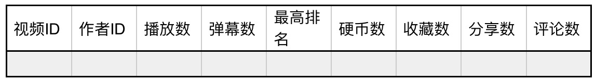
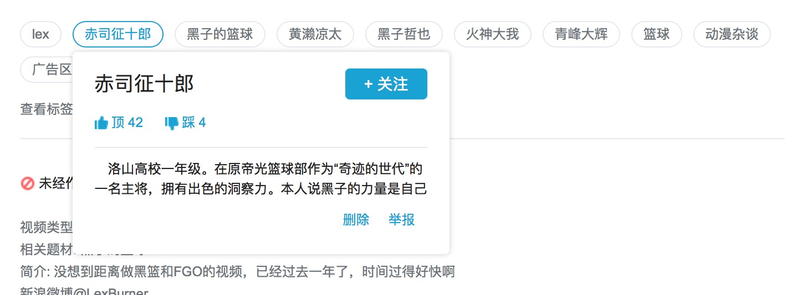
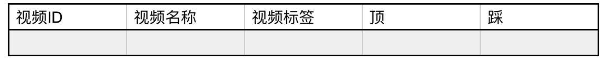
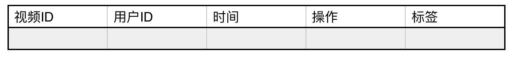
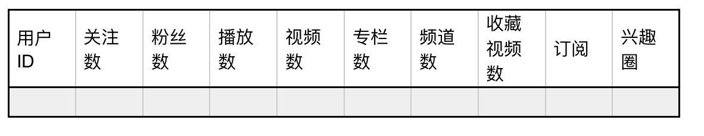

## part1
https://www.bilibili.com/ranking#!/all/0/1/7/

这个是B站热门视频排行榜
首先我需要把这个“综合”排行榜上100个视频的信息都抓下来
抓下来的数据结构大概这样    

| 视频id | 作者id | 播放数  | 弹幕数        | 硬币数   | 最高排名 | 收藏数     | 分享数   | 评论数     |
| :--: | :--: | ---- | ---------- | ----- | ---- | ------- | ----- | ------- |
| aid  | mid  | play | deo_review | coins | 无    | collect | share | comment |

https://www.bilibili.com/index/rank/all-07-0.json

## part2
接下来就是，我需要每个视频的标签信息

主要是作标签的内容分析，100个视频差不多就有七八百个标签了，人工分析差不多够了.标签的结构大概是这样

https://www.bilibili.com/video/av14534728/

https://api.bilibili.com/x/tag/archive/tags?aid=14534728&jsonp=jsonp

| 视频ID | 视频名称       | 视频标签     | 顶     | 踩     |
| ---- | ---------- | -------- | ----- | ----- |
| 文件名  | 对应top100的表 | tag_name | likes | hates |

## part3
然后我还需要每个标签的修改记录

https://api.bilibili.com/x/tag/archive/log?&aid=14534728&pn=1&ps=20&jsonp=jsonp

| 视频ID | 用户id | 时间     | 操作     | 标签              |
| ---- | ---- | ------ | ------ | --------------- |
| aid  | mid  | c_time | action | tag_id tag_name |

## part4
然后我需要每个参与了标签修改的用户的信息

20171112
1. 全站下的分区
2.  月排行
3.  user数据

完成时间时2017年11月30日

其他无关信息：
师姐，关于SP，在bilibili的sitemap里有大量的涉及。将其抽取出来可以发现。

http://www.bilibili.com/sitemap/sp.xml
